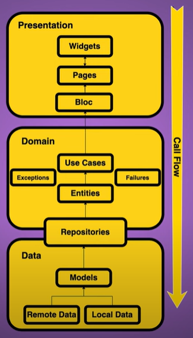

# Flutter Clean Architecture Template

A template for Flutter projects to help developers start new Flutter projects with a solid architecture that is easy to maintain and scale to create a high-quality application.

## Clean Architecture

The Clean Architecture is a software design philosophy that originated from the ideas of Robert C. Martin (Uncle Bob), aiming to create robust and easily maintainable systems. It advocates for clear separation of concerns and independence from external frameworks, promoting a flexible and adaptable architecture. By adopting the principles of Clean Architecture, developers can build applications that are easier to understand, test, and evolve over time. This approach is particularly useful in projects requiring long-term maintenance and scalability, offering a solid foundation for constructing complex applications in Flutter and other platforms.

|             |
|:------------:|
|  |


### Domain Layer

The Domain Layer serves as the core of the application, housing its fundamental business logic. This layer is designed to be independent of any external dependencies, fostering modularity and facilitating ease of testing. Within the Domain Layer, you'll find entities, use cases, repositories, and error handling mechanisms.

#### Entities

Entities represent the core data structures or business objects of the application. They encapsulate the essential properties and behaviors that define the application's domain. Entities are typically plain Dart classes that model real-world concepts relevant to the application.

#### Enums

Enums are used to represent a fixed set of values or states within the application. They provide a concise and type-safe way to define and manage different states, options, or categories. By using enums, developers can ensure that the application's logic is clear, robust, and easy to understand.

#### Use Cases (Interactors)

Use Cases, also known as Interactors, encapsulate specific application behaviors or use cases. They orchestrate the execution of business logic by interacting with entities and repositories. Use Cases are responsible for coordinating the flow of data and enforcing business rules, ensuring the integrity of the application's logic.

#### Repositories

Repositories act as an abstraction layer between the Domain Layer and the Data Layer. They define a set of interfaces or contracts that specify how data should be accessed and manipulated. Repositories provide methods for retrieving and storing data, shielding the Domain Layer from the details of data storage and retrieval mechanisms. Implementations of repositories are typically found in the Data Layer, while interfaces reside in the Domain Layer, allowing for easy substitution of data sources without impacting the application's core logic.

#### Failures

Within the Domain Layer, mechanisms for handling failures and errors are defined. These can include custom exception classes, error enums, or result types to communicate and manage failures gracefully. By centralizing error handling within the Domain Layer, the application can maintain a consistent approach to error reporting and recovery, enhancing reliability and maintainability.

### Data Layer

The Data Layer serves as the implementation hub for repositories defined in the Domain Layer. Its primary role revolves around data management, including retrieval from diverse sources such as network APIs, local databases, or any other relevant data store. Within this layer, repositories are implemented to handle data access and manipulation, ensuring seamless interaction between the application and external data sources. Additionally, the Data Layer encompasses the definition and structure of data models, which represent the data entities manipulated within the application. These models encapsulate the properties and behaviors of data entities, providing a structured format for data management throughout the application.

#### Models

Models represent the data entities used within the application. They define the structure and properties of data objects, enabling the application to interact with data in a consistent and structured manner. Models are typically plain Dart classes that map to data entities from external sources such as APIs or databases. It's an translation layer between the data source and the application, ensuring that data is represented in a format that is easy to work with and manipulate.

#### Repositories

Repositories in the Data Layer implement the interfaces defined in the Domain Layer, providing concrete implementations for data access and manipulation. These repositories interact with external data sources such as APIs, databases, or local data to retrieve and store data. By encapsulating data access logic within repositories, the Data Layer shields the Domain Layer from the complexities of data management, promoting separation of concerns and modularity.

### Presentation Layer

The Presentation Layer encompasses the User Interface (UI) of the application. Its primary responsibility lies in presenting data to the user and managing user interactions. This layer communicates with the UseCases in the Domain Layer to obtain data and update the UI accordingly. To achieve modularity and separation of concerns, I've opted to organize the Presentation Layer into multiple modules. Each module handles distinct parts of the application, allowing for better organization and scalability.

#### Pages

Pages represent the screens or views of the application. They are responsible for rendering the UI components and handling user interactions. Pages interact with controllers, providers, blocs, or other state management solutions to obtain data and update the UI based on user actions or external events.

#### Widgets

Widgets are reusable UI components that can be composed to build the UI of the application. Widgets encapsulate specific UI elements or behaviors, promoting code reusability and maintainability. By breaking down the UI into smaller, composable widgets, developers can create complex and dynamic interfaces with ease. Widgets can be used within pages, other widgets, or controllers to construct the UI of the application.

#### Controllers

Controllers are responsible for managing page states for UI purposes. By separating UI logic into controllers, the Presentation Layer can maintain a clear separation of concerns and facilitate efficient state management.

#### Stores

Stores play a crucial role in managing the application state and data flow comprehensively. They serve as a centralized hub for storing and updating application data, ensuring seamless propagation of changes across the entire application. Stores can be built using various state management solutions like Provider, Bloc, Riverpod, or MobX. Depending on the specific needs of your application and the chosen state management architecture, you have the flexibility to customize and adapt the store accordingly to meet those requirements.

### Folder Structure

```bash
├── app
│   ├── data
│   │   ├── models
│   │   └── repositories
│   │
│   ├── domain
│   │       ├── entities
│   │       ├── failures
│   │       ├── repositories
│   │       └── usecases
│   │
│   ├── presentation
│   │       ├── pages
│   │       ├── widgets
│   │       ├── controllers
│   │       └── stores
│   │
│   └── shared
│       ├── helpers
│       │   ├── enums
│       │   ├── environments
│       │   ├── functions
│       │   ├── services
│       │   │   ├── dio
│       │   │   ├── uno
│       │   │   ├── firebase
│       │   │   └── shared_preferences
│       │   └── utils
│       │
│       └── themes
│   
├── generated
│   └── intl
│ 
├── l10n
│
└── tests
    └── app
        ├── data
        │   ├── models
        │   └── repositories
        │
        ├── domain
        │       ├── entities
        │       ├── failures
        │       ├── repositories
        │       └── usecases
        │
        └── presentation
                ├── pages
                ├── widgets
                ├── controllers
                └── stores
```

## Routing

The [go_router](https://pub.dev/packages/go_router) is a lightweight and straightforward routing package for Flutter applications, simplifying the process of navigation between screens. It provides an intuitive API for defining routes and managing navigation within the application. With its simplicity and ease of use, the GoRouter is ideal for efficiently handling screen transitions and organizing navigation logic in Flutter projects.

## Dependency Injection

The [auto_injector](https://pub.dev/packages/auto_injector) package from Flutterando simplifies dependency injection in Flutter applications, offering an intuitive way to manage dependencies across the codebase. By automating the process of dependency injection, developers can easily instantiate and access objects without the need for manual setup, enhancing code readability and maintainability, making it an ideal choice for managing dependencies in complex Flutter applications.

## Internationalization (l10n)

The [flutter_intl](https://marketplace.visualstudio.com/items?itemName=localizely.flutter-intl) IDE extension simplifies internationalization (l10n) in Flutter applications, providing a seamless way to manage localization keys and translations directly within your IDE. By automating the process of internationalization, developers can efficiently handle multilingual support for their Flutter apps, improving user accessibility and reach. With its intuitive interface and powerful features, flutter_intl enhances the localization workflow, making it an indispensable tool for building global-ready Flutter applications.

## Network

We have multiple ways to use network requests in Flutter, but the most common and recommended way is to use the [dio](https://pub.dev/packages/dio) package. Dio is a powerful HTTP client for Dart and Flutter, providing a simple and flexible API for making network requests. With its support for various features such as interceptors, request cancellation, and error handling, Dio simplifies the process of working with APIs and managing network requests in Flutter applications. By leveraging Dio, developers can create robust and efficient networking solutions, enabling seamless communication with external services and data sources.

## Tests

[Testing](https://docs.flutter.dev/testing/overview) is an essential aspect of software development, ensuring the reliability and quality of applications. In Flutter, we can write different types of tests, including unit tests, widget tests, and integration tests, to validate the behavior and functionality of our code. By writing tests, developers can identify bugs early, prevent regressions, and maintain the stability of their applications. The Flutter testing framework provides a comprehensive suite of tools and utilities for writing tests, making it easy to create and run tests for various parts of the application. By adopting a test-driven development (TDD) approach, developers can build robust and maintainable Flutter applications with confidence.

## Environment

In folder **app/shared/helpers/environments**, you can find the environment configurations for the application. The environment configurations are used to manage different settings and configurations for the application based on the environment in which it is running. By defining environment-specific configurations, developers can easily switch between different settings for development, staging, and production environments, ensuring that the application behaves consistently across different deployment scenarios. The environment configurations can include API endpoints, feature flags, authentication settings, and other environment-specific parameters that influence the behavior of the application.

## Themes

In folder **app/shared/themes** is provided an easily customizable theming structure, including definitions for colors, text styles, and light/dark themes. The provided themes are designed to be easily tailored to fit the project's needs. For instance, you can customize primary, secondary, and accent colors to match your application's visual identity. Additionally, text styles can be adjusted to ensure visual consistency throughout the application. Support for light and dark themes is built-in, allowing end-users to select their preferred theme preference. With this flexible theming structure, you can create a cohesive and visually appealing user experience for your Flutter application.

## Logging

The [logger](https://pub.dev/packages/logger) package is a versatile logging solution for Dart and Flutter applications, offering a simple and efficient way to log messages and debug information. With its support for different log levels, custom log output formats, and log filtering, the logger package provides a powerful tool for monitoring and troubleshooting applications. By integrating the logger package into your Flutter project, you can easily track and analyze application behavior, identify issues, and improve the overall quality of your codebase. But I recommend using [Firebase Crashlytics](https://pub.dev/packages/firebase_crashlytics) for production environments.

## Name Format

### Files and Directories

- Files have the same name as the classes
- snake_case

### Classes

- CammelCase
- **Entity** suffix for entities (e.g., UserEntity)
- **UseCase** suffix for use cases (e.g., GetUserUseCase)
- **Failure** suffix for failures (e.g., UserFailure)
- **Interface** starts with **I** prefix (e.g., IUserRepository)
- **Repository** suffix for repositories (e.g., UserRepository)
- **Page** suffix for screens (e.g., HomePage)
- **Controller** suffix for controllers, with the prefix being the name of the page it controls (e.g., HomeController)
- **Store** suffix for stores (e.g., UserStore)

### Methods

- lowerCammelCase
- Verbs

### Variables

- lowerCammelCase
- Nouns

### Enums

- CammelCase
- **Enum** suffix for enums (e.g., UserRoleEnum)

### Tests

- **Test** suffix for test files (e.g., user_repository_test.dart)
- snake_case


## References

- [Clean Architecture: A Craftsman's Guide to Software Structure and Design](https://blog.cleancoder.com/uncle-bob/2012/08/13/the-clean-architecture.html)
- [Flutterando Clean Dart](https://github.com/Flutterando/Clean-Dart)
